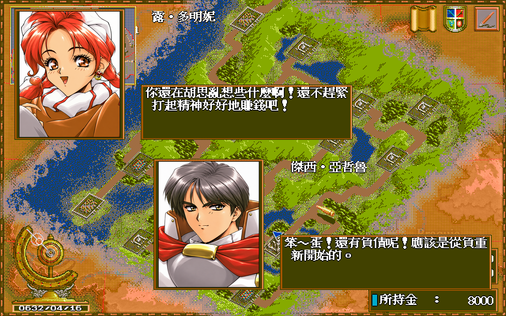
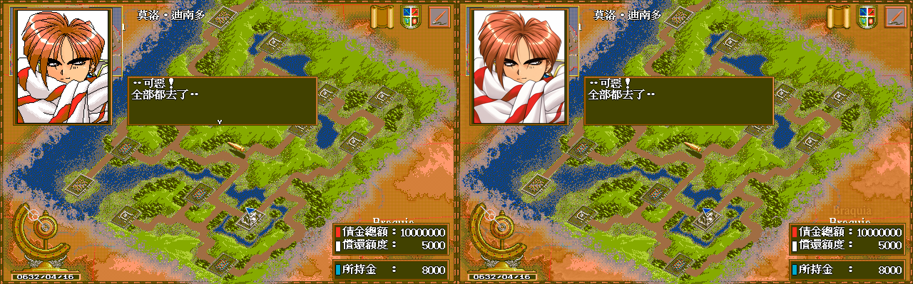
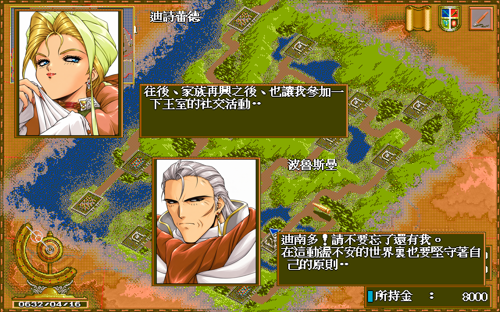
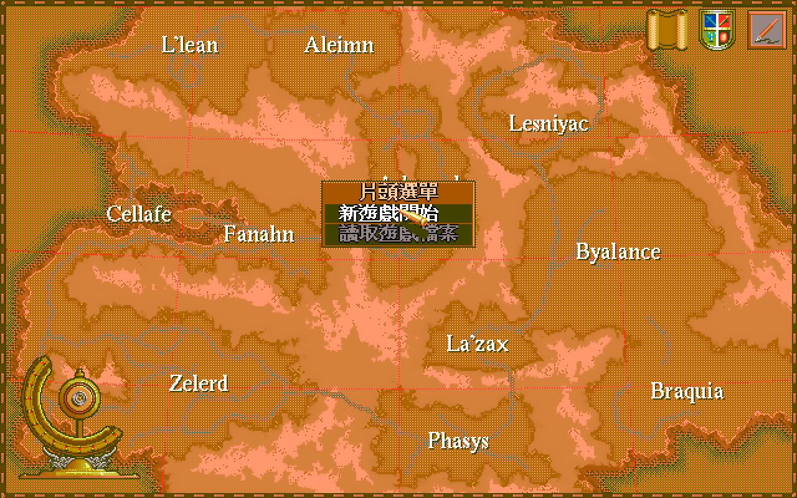
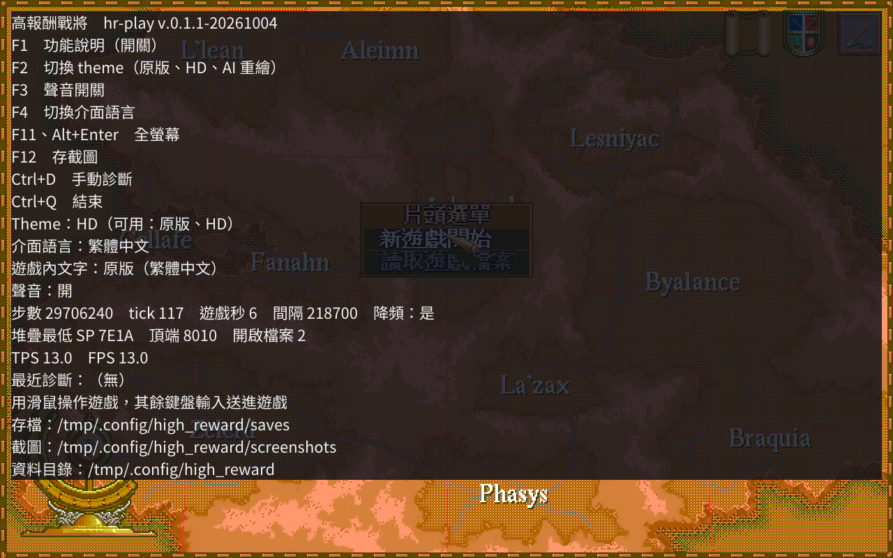

# 高報酬戰將 Remastered

用 [dosgolem](https://github.com/wicanr2/dosgolem)（以 Go 寫的 DOS 執行器）在 Linux、Windows、macOS 上執行 DOS 版《高報酬戰將》（日文原名ハイリワード，High Reward），並加上長時間遊玩的堆疊溢位修補與 2 倍 HD 圖層。遊戲本體需要自備，本專案不含任何原版檔案。

本專案是獨立的第三方保存與研究專案，與原版權利人沒有隸屬、合作或授權關係。

## 新版 AI 手繪風格

新版肖像由 OpenAI 依原版美術重繪，採手繪風格。上圖是載入完整 595 項 AI 主題後，從新遊戲正常操作擷取的畫面。遊戲規則、文字與座標沿用原版；地形、文字與框線仍可看到原版像素。目前 AI 素材只留本機，私人 Release 尚未包含。

## 原版檔案與權利邊界

- 本 repo 不含原版的執行檔、資料檔、字型、圖像與音樂。請自備一份合法取得的原版（內含 `MAIN.EXE` 的資料夾）。
- 本專案研究用的原版取自第三方轉載站，權利人未查證，轉載不構成散布授權（`docs/re/001-source-intake.md`）。
- 授權是 RRSAL-1.0（`LICENSE`，source-available）。非商業用途免費，遊戲實況與評論明示允許，商業用途需另行洽談。授權只涵蓋本專案作者的創作，不涵蓋原版素材。
- `hd/` 的 595 張 HD 圖是原版美術的衍生物，`docs/images/` 的截圖含原版畫面。本 repo 為 private，含 HD 素材的發行包只供私人流通。轉公開、公開發行包之前，先處理 git 歷史並更新 `LICENSE` 第 2 條 (c)（`AGENTS.md` 第 2 節）。

## 遊戲介紹

### 版本與發行

| 項目 | 內容 | 來源 |
|---|---|---|
| PC-98 版 | 1994 年 9 月。廠商多列為 Imagineer（イマジニア），有兩份資料並列 ENIX。定價 9,800 日圓，2HD 磁片 4 枚 | [retroblues 的 Imagineer 作品表](http://retroblues.sakura.ne.jp/regeokiba/imagineer/imagineer.htm)、[PC98 資料頁](https://refuge.tokyo/pc9801/pc98/01913.html)、[巴哈姆特〈[骨灰遊戲]PC98_戰略RPG_高報酬戰將ハイリワード〉](https://home.gamer.com.tw/artwork.php?sn=805367) |
| 發售日 | retroblues 記 9 月 22 日，[1994 年 PC 遊戲年表](https://golden-decade.net/2020/10/02/pcgame1994/)記 9 月 1 日，兩者不一致，本專案未能查到原始發售公告 | 上列來源 |
| DOS 中文版 | 彩虹代理，1996 年 2 月 10 日。台灣由彩虹高科技代理 | [巴哈姆特〈老Ｇａｍｅ：中文遊戲列表 v3.04〉](https://home.gamer.com.tw/artwork.php?sn=5627530)、[骨灰遊戲站列表](https://boneash.oldgame.tw/Pc/pcgame-wg.html)（記 1996）、前述巴哈姆特文章 |

本專案取得的版本是否就是彩虹 1996 年版，沒有查證。`MAIN.EXE` 內的 `Borland C++ - Copyright 1993` 是編譯器的版權年份，不是遊戲的發行年份。

### 故事

科學與貿易正在改變這片大陸。舊貴族逐漸失勢，商路糾紛與地方叛亂卻讓傭兵有了生意。主角的父親去世後，家族留下高達一千萬的債務。世界銀行定期上門收款，主角只好與夥伴組成傭兵團，從有限的資金開始接工作、養隊伍，設法還清債款。（[PC-98 版遊戲背景與玩法資料](https://refuge.tokyo/pc9801/pc98/01913.html)；本專案 DOS 版的債額見下方「新遊戲開場」截圖。）

這趟旅程沒有指定的賺錢路線。鎮壓叛軍、運送貨物、交易與演出都能帶來收入；每筆報酬也得支付裝備、兵員與還款。遊戲讓玩家自行決定如何經營這支傭兵團。（[PC-98 版玩法資料](https://refuge.tokyo/pc9801/pc98/01913.html)）

### 玩法

PC-98 資料頁把它歸為即時模擬遊戲，世界觀是槍械與火砲（[PC98 資料頁](https://refuge.tokyo/pc9801/pc98/01913.html)）。1998 年的一篇日文評論也指出，還債是主要目標，事件沒有固定的單一路線（[ぼやき部屋，1998-09-30](http://kareha-azuretune.blogspot.com/1998/09/blog-post_30.html)）。

本專案取得的 DOS 版，開場畫面顯示債金總額 10,000,000，所持金 8,000（見下方截圖）。已知的玩法元素：

- 六支小隊的招募與薪資管理（[巴哈姆特，2009-12-08](https://home.gamer.com.tw/artwork.php?sn=805367)）。
- 陣型影響士兵火力與防線（同上；[GameTime 攻略，2020-01-11](https://palygametime.pixnet.net/blog/post/2137558-%E3%80%90dos%E3%80%91%E9%AB%98%E5%A0%B1%E9%85%AC%E6%88%B0%E5%B0%87%E6%94%BB%E7%95%A5)有練級用的陣型建議）。
- 收入來源有民事任務（GameTime 攻略記每趟一至九萬）、軍事任務（十幾萬以上）與舞蹈團演出，攻略另有貿易路線的建議。巴哈姆特文章還提到做打手、經營商隊與做快遞。
- 巴哈姆特文章作者評為自由度高，但最後的目標就是賺錢，沒有像《文明帝國》那樣的多重破關條件。

### 玩家的當機回報

PTT Old-Games 版 2015 年 9 至 10 月的一串推文裡，有一則寫「當機是中文dos版才有當機bug pc98不會當機」（[PTT Old-Games](https://www.ptt.cc/bbs/Old-Games/M.1442537912.A.280.html)）。這是網友留言，沒有重現步驟，也沒有對照原版的證據。本專案的當機調查見下文。

## 現況

唯一的現況入口是 `AGENTS.md` 的「里程碑」表，逐輪紀錄在 `WORKLOG.md`。

| 項目 | 現況 | 證據 |
|---|---|---|
| 執行 `MAIN.EXE` | dosgolem 內可到標題、新遊戲、讀檔、存檔、系統選單與戰鬥佈陣。不播片頭與片尾，只執行主程式。音樂與音效依規格 007 播放：攔截遊戲的聲音常式，前端以自寫的 FM 合成器播 `.MID`、以 8 kHz 播 `SOUND_E.PCM`，音色是近似（原版沒附 `CTMIDI.DRV`，沒有原版錄音可對拍）；沒有音訊裝置時靜音運行；真實音訊裝置與 macOS 的輸出未驗證 | `docs/re/008`、`docs/re/012`、`docs/spec/007`、`docs/re/019` |
| 當機 | 重現並修補一個堆疊溢位。這是否就是玩家回報的當機，未確認 | `docs/re/011`、`docs/spec/002` |
| 當機與 hang 的診斷紀錄 | 遊戲停機、疑似 hang（遊戲碼的服務中斷靜默 30 遊戲秒）或按 Ctrl+D 時，存一份診斷：暫存器、呼叫鏈、最近的呼叫與服務中斷、最後呼叫的 routine、畫面與狀態檔。模擬 hang 的收據見報告 | `docs/spec/005`、`docs/re/017` |
| 自動遊玩測試 | 機器人在 dosgolem 內以人類節奏遊玩，修補與原版 4 KB 堆疊各兩個種子，每組 2 遊戲小時：沒有當機與凍結，原版堆疊最深用到約一半。沒有走到 `docs/re/011` 的溢位路徑，不等於人類遊玩，也不能排除該溢位 | `docs/re/016` |
| HD 圖層 | 595 張 2 倍圖，使用者看過六個代表畫面的合成圖後整體接受。精靈、頭像、戰鬥舞台背景、標題地圖與游標有替換，大地形底圖、文字與框線仍是原版像素 | `docs/spec/004`、`docs/re/014`、`docs/re/015` |
| AI 重繪圖層 | 本機主題有 595 項圖像。585 張新增圖由 OpenAI 生成，另有 9 張先前接受的代表圖；1 張因服務拒絕而沿用 HD。已驗尺寸、遮罩與 F2 切換，尚未逐畫面驗收；素材不在發行包 | `AGENTS.md` M8、`WORKLOG.md` |
| 遊戲內多語系 | 五語各 17 項試點已接通本機建包，韓文採 8 像素空白。四個新語言的七檔全量譯文已由使用者接受，尚待逐批導入。Linux 開場對白、據點、重用與失敗回退只驗過試點；既有私人 Release 不含語言包，預設遊戲內文字仍是原版繁中 | `docs/spec/008`、`docs/re/031`、`docs/re/032` |
| 發行包 | [私人 Release `v.0.1.1-20261004`](https://github.com/wicanr2/high_reward_remastered/releases/tag/v.0.1.1-20261004) 提供 Linux AppImage、Windows zip、macOS universal，含 HD 圖層，不含原版遊戲檔案。本機 `v.0.1.0-20261004` 完整封包含原版，36 秒推廣影片也只供私人驗收。Linux 已從實包進入新遊戲，Windows 在 Wine 內顯示標題，macOS 只驗結構，沒有實機 | `docs/re/013`、`dist-all/v.0.1.1-20261004/smoke/RESULTS.txt` |

## 主要成果

### 堆疊溢位

原版啟動碼從 `_stklen` 讀到 4096 bytes，`SP` 起點是 `0x1010`。在最深的選單內載入圖形時，呼叫鏈用完堆疊，`SP` 減過 0 繞回 `FFxx`，之後一個 `retf` 取到垃圾位址，跳進視訊記憶體。這個當機在 dosgolem 內用存檔槽 2、種子 22 的隨機輸入長跑重現，兩次執行的步數與暫存器相同（`docs/re/011`）。修補在執行時於記憶體內把 `_stklen` 由 `0x1000` 改成 `0x8000`，不改動原版檔案（`docs/spec/002-stack-size.md`）。

### 圖像格式

全部圖像容器與壓縮格式已解碼（`docs/re/006`），`MAIN.EXE` 的 `FBOV` 區含 139 段 overlay，結構與位址換算見 `docs/re/007`。

### HD 疊層

遊戲照原樣用 VGA 畫出，疊層在每一幀依 VRAM 內容驗證後，把精靈、頭像、戰鬥舞台背景、標題地圖與游標換成 2 倍的 HD 圖。不改遊戲邏輯、座標與存檔。規格 `docs/spec/004-hd-overlay.md`，實作收據 `docs/re/014`。HD 圖缺漏時回退原圖。

## 截圖

下列截圖都是 dosgolem 執行原版 `MAIN.EXE` 的畫面。並排圖左側是原版，右側依標題分別為 HD 或 AI 重繪疊層。遊戲畫面的著作權屬於原權利人，這裡只用來說明本專案的執行結果。

### 標題畫面

冷啟動後停在標題選單。標題地圖底圖與游標換成 HD，選單文字與框線仍是原版像素。對照圖由 `hrhd` 產生（`docs/re/014` 第 9 節）。

### 新遊戲開場

選「新遊戲開始」後的第二個對話框，畫面右下可見債金總額 10,000,000 與所持金 8,000。頭像與精靈換成 HD，大地形底圖、文字與框線沒有替換。

### AI 重繪的新遊戲畫面

在 Linux 的 Xvfb 內正常點選「新遊戲開始」，再以 F2 切換圖層擷取同一段對話。右側載入完整 AI 主題，肖像由 OpenAI 重繪；對白仍由原版 `MAIN.EXE` 繪製。

繼續開場對話可看到其他角色的重繪肖像。這批畫面確認開場的顯示與切換，沒有涵蓋遊戲全程。擷取入口為 `tools/ai/capture_readme.sh`，來源與畫面摘要記在 `WORKLOG.md`。

### 戰鬥佈陣

戰鬥舞台的背景與單位換成 HD，數值表與文字仍是原版像素。

### 局部放大

HD 圖由演算法放大並去除抖色，處理方法見 `docs/re/015-hd-art-method.md`。

### 實際打包的前端

含 HD 的 AppImage（版本 `034771b-dg49d5eed-hd`）在 Xvfb 內啟動，原版放在 `.AppImage` 旁的 `original`，點新遊戲後的視窗（1280x800，HD 自動啟用）。驗收說明見 `docs/re/013` 第 4.3 節。

### v.0.1.1 新版前端

這三張畫面取自 `v.0.1.1-20261004` Linux AppImage 的 Xvfb 驗收：冷啟動標題、點選新遊戲、開啟 F1 功能面板。面板顯示前端按鍵、目前的 HD 與語言狀態，以及診斷資訊。驗收紀錄在 `dist-all/v.0.1.1-20261004/smoke/RESULTS.txt`。

### 自動遊玩

原版畫面，沒有 HD。遊玩機器人在 dosgolem 內遊玩約 40 遊戲分鐘時的世界地圖（遊戲內日期 0632/06/06，640x480 VGA 畫面，上方 40 列是空白）。機器人是自動化的近似，不等於人類遊玩，說明見 `docs/re/016`。

## 執行

### 使用發行包

1. 從 [v.0.1.1-20261004 私人 Release](https://github.com/wicanr2/high_reward_remastered/releases/tag/v.0.1.1-20261004) 取得對應平台的發行包。包內有 HD 圖層，沒有原版遊戲檔案。
2. 把原版（內含 `MAIN.EXE` 的資料夾內容）放進程式旁的 `original` 資料夾，或用 `hr-play -orig <資料夾>` 指定。Linux AppImage 把 `original` 放在 `.AppImage` 旁。macOS 放進 `HighReward.app/Contents/Resources/original`。
3. 執行 `hr-play`，用滑鼠操作遊戲。找到 `hd/` 目錄會自動啟用 HD，`-no-hd` 可看原版畫面。

本機開發版可用 `-hd-ai <AI 圖層目錄> -theme ai` 載入 AI 重繪圖層；目前的私人 Release 不含這批素材。

本機開發版另支援英文、簡中、日文、韓文各 17 項試點，韓文詞間空白為 8 像素。譯文表放在 `l10n/<代碼>/`，同目錄的 `glyph-patch/` 直接放五檔字模補丁；以 `-lang <代碼> -l10n <l10n 目錄>` 啟動時建包並驗證，代碼為 `en`、`zh-CN`、`ja` 或 `ko`。F1 顯示部分翻譯狀態，F4 的遊戲內語言選擇在下次啟動生效。表或補丁不完整時回到原版文字；新增字元或英文雙字組須重新烘製補丁。這批功能與本機譯文、補丁尚未納入私人 Release，完整契約見 `docs/spec/008`。

按鍵（保留給程式，不送進遊戲；完整清單與修飾鍵組合見 `docs/spec/006` 第 2 節）：F1 功能說明與統計，F2 切換 theme（原版、HD、AI 重繪，只列出可用的），F3 聲音開關，F4 切換介面語言（繁體中文、簡體中文、韓文、英文、日文；遊戲內文字不隨之改變，見 `docs/spec/008`），F11 或 Alt+Enter 全螢幕，F12 存截圖，Ctrl+Q 結束，Ctrl+D 手動存一份診斷（遊戲 hang 住時用）。macOS 筆電的 F1 至 F4 預設是亮度與系統功能，要按 Fn。使用者資料目錄的 `high_reward/`（Linux 在 `~/.config`，macOS 在 `~/Library/Application Support`，Windows 在 `%AppData%`）存放 `saves`、`screenshots`、`crash`（停機、hang 與 Ctrl+D 的診斷，每份含 `info.txt`、畫面與狀態檔，回報當機時提供這個目錄，不要貼到公開的 issue）與每分鐘一行的 `play.log`。原版資料夾不會被修改。

macOS 版沒有簽章，首次開啟請右鍵選「打開」。

### 從原始碼建置

所有建置、測試與打包都在 Docker 內進行，主機只需要 Docker 與 git。原版放在 `workplace/orig`，遊戲專屬程式在 `workplace/dosgolem` 的 `hr` 分支（`engine/patches/` 是該分支的 patch 備份，分層說明見 `AGENTS.md` 第 4 節）。

| 命令 | 用途 |
|---|---|
| `tools/play.sh test` | 跑 `apps/hr` 的測試 |
| `tools/play.sh build` | 建 Linux amd64 的 `hr-play` |
| `tools/play.sh gui` | 在 Xvfb 內啟動視窗、點新遊戲並截圖 |
| `tools/package.sh all` | 建三平台發行包，並以原版雜湊與檔名掃描外洩 |
| `HR_WITH_HD=1 tools/package.sh all` | 同上，包內含 `hd/`，產物在 `dist-all/with-hd/` |
| `HR_VERSION=v.0.1.1-20261004 bash tools/package_release_patch.sh` | 在 Docker 內建立不含原版的三平台私人 Release 包，輸出至 `dist-all/<版本>/patch/` |
| `HR_VERSION=v.0.1.1-20261004 bash tools/finalize_release_patch.sh` | 在 Docker 內記錄 Release 包的大小、SHA-256 與兩份來源提交 |
| `HR_VERSION=v.0.1.0-20261004 bash tools/package_full_local.sh` | 在 Docker 內以 `tools/pkg/full_local.py` 對照原版清冊，建置只留本機的三平台完整版；包內說明見 `packaging/README.full-local.txt`，不可提交或上傳 |
| `HR_VERSION=v.0.1.0-20261004 bash tools/promo.sh` | 在 Docker 內以本版 AppImage 畫面及既有 HD 戰鬥對照製作本機推廣影片；影片含原版美術與音樂衍生內容，不可公開上傳 |
| `HR_VERSION=v.0.1.0-20261004 bash tools/finalize_full_local.sh` | 三平台包與影片驗收後，在 Docker 內產生 `dist-all/<版本>/SHA256SUMS.json` |
| `tools/bot.sh run <名稱>` | 執行遊玩機器人；`-hang-routine SEG:OFF` 模擬某個 routine 進入後不返回 |
| `tools/play.sh test-diag` | 診斷功能的測試 |
| `tools/play.sh gui-diag` | Xvfb 內啟動視窗、按 Ctrl+D，確認診斷產生 |
| `tools/play.sh test-hd` | `apps/hr/hd` 的測試（含 `-race`） |
| `tools/play.sh gui-lang`、`gui-theme` | Xvfb 內按 F4 循環語言、按 F2 切 theme，比對截圖 |
| `bash tools/ai/capture_readme.sh <新的標籤>` | 在 Docker 內正常操作新遊戲，擷取完整 AI 主題與 F2 對照；需本機原版、開發前端及 AI 主題，畫面與來源摘要留在 `workplace/out/` |
| `bash tools/l10n/verify_en_gui.sh <新的標籤> [代碼]` | Xvfb 內驗所選語言試點、重用、F4 下次啟動、缺補丁回退與損壞包重建；代碼可用 `en`、`zh-CN`、`ja`、`ko`，省略時預設英文，需本機表及補丁，畫面留在 `workplace/` |

原版缺失時，依賴它的測試會明確 skip，不使用替代品。

## 文件導航

| 位置 | 內容 |
|---|---|
| `AGENTS.md` | 專案規則、里程碑與定案事項 |
| `WORKLOG.md` | 逐輪紀錄與勘誤 |
| `docs/re/` | 證據：位址、雜湊、樣本、推論等級與重跑方法，`source-inventory.tsv` 是原版檔案清冊 |
| `docs/spec/` | 規格：堆疊（002）、執行層與前端（003）、HD 疊層（004） |
| `hd/` | 595 張 2 倍 HD 圖與清冊、調色盤表、逐張來源紀錄 |
| `engine/patches/` | dosgolem `hr` 分支的 patch 備份 |
| `packaging/` | 發行包內附的說明文字 |
| `tools/` | Docker 包裝腳本、清冊與打包工具 |

## 授權

RRSAL-1.0，全文見 `LICENSE`，繁體中文為準。第三方元件依各自的授權提供。
