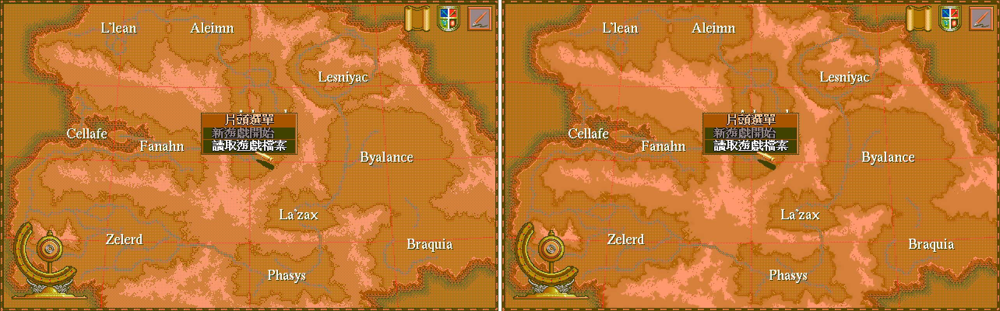
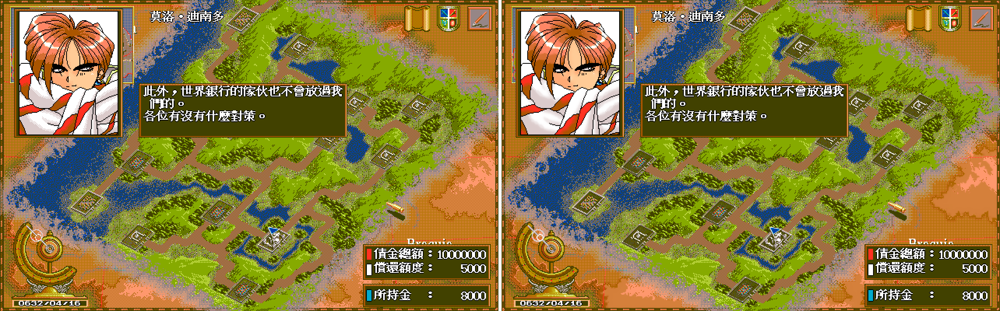
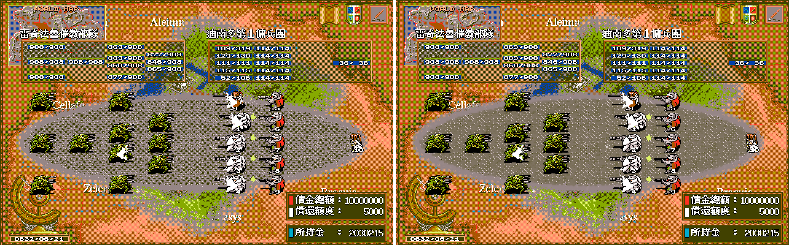
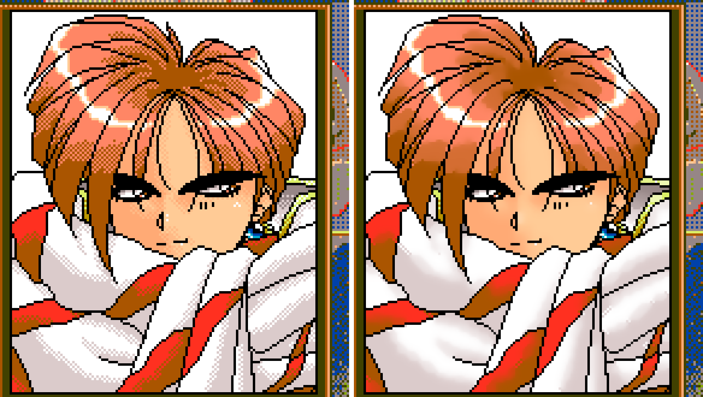
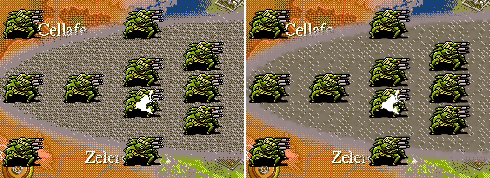
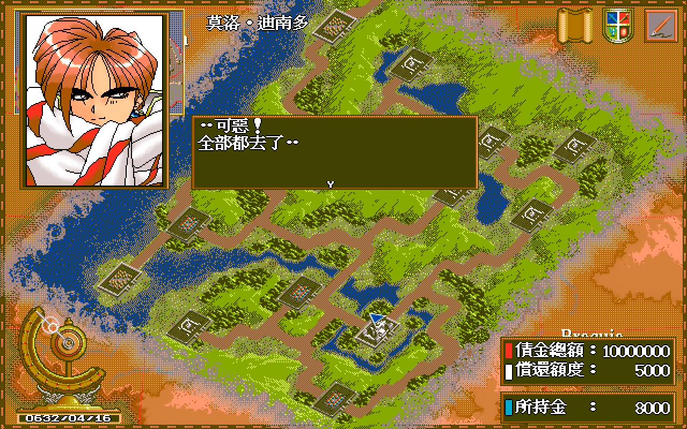
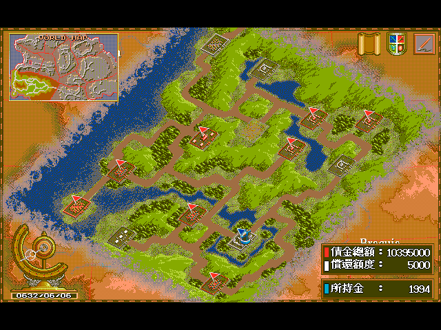

# 高報酬戰將 Remastered

用 [dosgolem](https://github.com/wicanr2/dosgolem)（以 Go 寫的 DOS 執行器）在 Linux、Windows、macOS 上執行 DOS 版《高報酬戰將》（日文原名ハイリワード，High Reward），並加上長時間遊玩的堆疊溢位修補與 2 倍 HD 圖層。遊戲本體需要自備，本專案不含任何原版檔案。

本專案是獨立的第三方保存與研究專案，與原版權利人沒有隸屬、合作或授權關係。

## 原版檔案與權利邊界

- 本 repo 不含原版的執行檔、資料檔、字型、圖像與音樂。請自備一份合法取得的原版（內含 `MAIN.EXE` 的資料夾）。
- 本專案研究用的原版取自第三方轉載站，權利人未查證，轉載不構成散布授權（`docs/re/001-source-intake.md`）。
- 授權是 RRSAL-1.0（`LICENSE`，source-available）。非商業用途免費，遊戲實況與評論明示允許，商業用途需另行洽談。授權只涵蓋本專案作者的創作，不涵蓋原版素材。
- `hd/` 的 595 張 HD 圖是原版美術的衍生物，`docs/images/` 的截圖含原版畫面。本 repo 為 private，含 HD 素材的發行包只供私人流通。轉公開、公開發行包之前，先處理 git 歷史並更新 `LICENSE` 第 2 條 (c)（`AGENTS.md` 第 2 節）。

## 遊戲介紹

### 版本與發行

| 項目 | 內容 | 來源 |
|---|---|---|
| PC-98 版 | 1994 年 9 月。廠商多列為 Imagineer（イマジニア），有兩份資料並列 ENIX。定價 9,800 日圓，2HD 磁片 4 枚 | [retroblues 的 Imagineer 作品表](http://retroblues.sakura.ne.jp/regeokiba/imagineer/imagineer.htm)、[PC98 資料頁](https://refuge.tokyo/pc9801/pc98/01913.html)、[巴哈姆特〈[骨灰遊戲]PC98_戰略RPG_高報酬戰將ハイリワード〉](https://home.gamer.com.tw/artwork.php?sn=805367) |
| 發售日 | retroblues 記 9 月 22 日，[1994 年 PC 遊戲年表](https://golden-decade.net/2020/10/02/pcgame1994/)記 9 月 1 日，兩者不一致，本專案未能查到原始發售公告 | 上列來源 |
| DOS 中文版 | 彩虹代理，1996 年 2 月 10 日。台灣由彩虹高科技代理 | [巴哈姆特〈老Ｇａｍｅ：中文遊戲列表 v3.04〉](https://home.gamer.com.tw/artwork.php?sn=5627530)、[骨灰遊戲站列表](https://boneash.oldgame.tw/Pc/pcgame-wg.html)（記 1996）、前述巴哈姆特文章 |

本專案取得的版本是否就是彩虹 1996 年版，沒有查證。`MAIN.EXE` 內的 `Borland C++ - Copyright 1993` 是編譯器的版權年份，不是遊戲的發行年份。

### 玩法

主角在父親過世後揹上巨額債務，與夥伴組成傭兵團，靠接案還債。PC-98 資料頁把它歸為即時模擬遊戲，世界觀是槍械而非劍與魔法（[PC98 資料頁](https://refuge.tokyo/pc9801/pc98/01913.html)）。1998 年的一篇日文評論把目標寫成還債，而且是非常龐大的債，並說沒有一條線的劇情，無視事件也有可能破關（[ぼやき部屋，1998-09-30](http://kareha-azuretune.blogspot.com/1998/09/blog-post_30.html)）。

本專案取得的 DOS 版，開場畫面顯示債金總額 10,000,000，所持金 8,000（見下方截圖）。已知的玩法元素：

- 六支小隊的招募與薪資管理（[巴哈姆特，2009-12-08](https://home.gamer.com.tw/artwork.php?sn=805367)）。
- 陣型影響士兵火力與防線（同上；[GameTime 攻略，2020-01-11](https://palygametime.pixnet.net/blog/post/2137558-%E3%80%90dos%E3%80%91%E9%AB%98%E5%A0%B1%E9%85%AC%E6%88%B0%E5%B0%87%E6%94%BB%E7%95%A5)有練級用的陣型建議）。
- 收入來源有民事任務（GameTime 攻略記每趟一至九萬）、軍事任務（十幾萬以上）與舞蹈團演出，攻略另有貿易路線的建議。巴哈姆特文章還提到做打手、經營商隊與做快遞。
- 巴哈姆特文章作者評為自由度高，但最後的目標就是賺錢，沒有像《文明帝國》那樣的多重破關條件。

### 玩家的當機回報

PTT Old-Games 版 2015 年 9 至 10 月的一串推文裡，有一則寫「當機是中文dos版才有當機bug pc98不會當機」（[PTT Old-Games](https://www.ptt.cc/bbs/Old-Games/M.1442537912.A.280.html)）。這是網友留言，沒有重現步驟，也沒有對照原版的證據。本專案的當機調查見下文。

## 現況

唯一的現況入口是 `AGENTS.md` 的「里程碑」表，逐輪紀錄在 `WORKLOG.md`。

| 項目 | 現況 | 證據 |
|---|---|---|
| 執行 `MAIN.EXE` | dosgolem 內可到標題、新遊戲、讀檔、存檔、系統選單與戰鬥佈陣。沒有聲音，不播片頭與片尾，只執行主程式 | `docs/re/008`、`docs/re/012` |
| 當機 | 重現並修補一個堆疊溢位。這是否就是玩家回報的當機，未確認 | `docs/re/011`、`docs/spec/002` |
| 自動遊玩測試 | 機器人在 dosgolem 內以人類節奏遊玩，修補與原版 4 KB 堆疊各兩個種子，每組 2 遊戲小時：沒有當機與凍結，原版堆疊最深用到約一半。沒有走到 `docs/re/011` 的溢位路徑，不等於人類遊玩，也不能排除該溢位 | `docs/re/016` |
| HD 圖層 | 595 張 2 倍圖，使用者看過六個代表畫面的合成圖後整體接受。精靈、頭像、戰鬥舞台背景、標題地圖與游標有替換，大地形底圖、文字與框線仍是原版像素 | `docs/spec/004`、`docs/re/014`、`docs/re/015` |
| 發行包 | Linux AppImage、Windows zip、macOS universal。Linux 與 Windows 已啟動驗收（Windows 在 Wine 內只驗標題畫面），macOS 只驗檔案結構，沒有實機 | `docs/re/013` |

## 主要成果

### 堆疊溢位

原版啟動碼從 `_stklen` 讀到 4096 bytes，`SP` 起點是 `0x1010`。在最深的選單內載入圖形時，呼叫鏈用完堆疊，`SP` 減過 0 繞回 `FFxx`，之後一個 `retf` 取到垃圾位址，跳進視訊記憶體。這個當機在 dosgolem 內用存檔槽 2、種子 22 的隨機輸入長跑重現，兩次執行的步數與暫存器相同（`docs/re/011`）。修補在執行時於記憶體內把 `_stklen` 由 `0x1000` 改成 `0x8000`，不改動原版檔案（`docs/spec/002-stack-size.md`）。

### 圖像格式

全部圖像容器與壓縮格式已解碼（`docs/re/006`），`MAIN.EXE` 的 `FBOV` 區含 139 段 overlay，結構與位址換算見 `docs/re/007`。

### HD 疊層

遊戲照原樣用 VGA 畫出，疊層在每一幀依 VRAM 內容驗證後，把精靈、頭像、戰鬥舞台背景、標題地圖與游標換成 2 倍的 HD 圖。不改遊戲邏輯、座標與存檔。規格 `docs/spec/004-hd-overlay.md`，實作收據 `docs/re/014`。HD 圖缺漏時回退原圖。

## 截圖

下列截圖都是 dosgolem 執行原版 `MAIN.EXE` 的畫面，並排對照圖的左半是原版畫面，右半是 HD 疊層。遊戲畫面的著作權屬於原權利人，這裡只用來說明本專案的執行結果。

### 標題畫面

冷啟動後停在標題選單。標題地圖底圖與游標換成 HD，選單文字與框線仍是原版像素。對照圖由 `hrhd` 產生（`docs/re/014` 第 9 節）。

### 新遊戲開場

選「新遊戲開始」後的第二個對話框，畫面右下可見債金總額 10,000,000 與所持金 8,000。頭像與精靈換成 HD，大地形底圖、文字與框線沒有替換。

### 戰鬥佈陣

戰鬥舞台的背景與單位換成 HD，數值表與文字仍是原版像素。

### 局部放大

HD 圖由演算法放大並去除抖色，處理方法見 `docs/re/015-hd-art-method.md`。

### 實際打包的前端

含 HD 的 AppImage（版本 `034771b-dg49d5eed-hd`）在 Xvfb 內啟動，原版放在 `.AppImage` 旁的 `original`，點新遊戲後的視窗（1280x800，HD 自動啟用）。驗收說明見 `docs/re/013` 第 4.3 節。

### 自動遊玩

原版畫面，沒有 HD。遊玩機器人在 dosgolem 內遊玩約 40 遊戲分鐘時的世界地圖（遊戲內日期 0632/06/06，640x480 VGA 畫面，上方 40 列是空白）。機器人是自動化的近似，不等於人類遊玩，說明見 `docs/re/016`。

## 執行

### 使用發行包

1. 取得發行包。含 HD 的包在 private repo 的 Release，不含 HD 的包由 `tools/package.sh all` 建置。
2. 把原版（內含 `MAIN.EXE` 的資料夾內容）放進程式旁的 `original` 資料夾，或用 `hr-play -orig <資料夾>` 指定。Linux AppImage 把 `original` 放在 `.AppImage` 旁。macOS 放進 `HighReward.app/Contents/Resources/original`。
3. 執行 `hr-play`，用滑鼠操作遊戲。找到 `hd/` 目錄會自動啟用 HD，`-no-hd` 可看原版畫面。

按鍵：F1 說明與統計，F11 或 Alt+Enter 全螢幕，F12 存截圖，Ctrl+Q 結束。使用者資料目錄的 `high_reward/`（Linux 在 `~/.config`，macOS 在 `~/Library/Application Support`，Windows 在 `%AppData%`）存放 `saves`、`screenshots`、`crash`（異常停機時的現場）與每分鐘一行的 `play.log`。原版資料夾不會被修改。

macOS 版沒有簽章，首次開啟請右鍵選「打開」。

### 從原始碼建置

所有建置、測試與打包都在 Docker 內進行，主機只需要 Docker 與 git。原版放在 `workplace/orig`，遊戲專屬程式在 `workplace/dosgolem` 的 `hr` 分支（`engine/patches/` 是該分支的 patch 備份，分層說明見 `AGENTS.md` 第 4 節）。

| 命令 | 用途 |
|---|---|
| `tools/play.sh test` | 跑 `apps/hr` 的測試 |
| `tools/play.sh build` | 建 Linux amd64 的 `hr-play` |
| `tools/play.sh gui` | 在 Xvfb 內啟動視窗、點新遊戲並截圖 |
| `tools/package.sh all` | 建三平台發行包，並以原版雜湊與檔名掃描外洩 |
| `HR_WITH_HD=1 tools/package.sh all` | 同上，包內含 `hd/`，產物在 `dist-all/with-hd/` |
| `tools/bot.sh run <名稱>` | 執行遊玩機器人 |

原版缺失時，依賴它的測試會明確 skip，不使用替代品。

## 文件導航

| 位置 | 內容 |
|---|---|
| `AGENTS.md` | 專案規則、里程碑與定案事項 |
| `WORKLOG.md` | 逐輪紀錄與勘誤 |
| `docs/re/` | 證據：位址、雜湊、樣本、推論等級與重跑方法，`source-inventory.tsv` 是原版檔案清冊 |
| `docs/spec/` | 規格：堆疊（002）、執行層與前端（003）、HD 疊層（004） |
| `hd/` | 595 張 2 倍 HD 圖與清冊、調色盤表、逐張來源紀錄 |
| `engine/patches/` | dosgolem `hr` 分支的 patch 備份 |
| `packaging/` | 發行包內附的說明文字 |
| `tools/` | Docker 包裝腳本、清冊與打包工具 |

## 授權

RRSAL-1.0，全文見 `LICENSE`，繁體中文為準。第三方元件依各自的授權提供。
