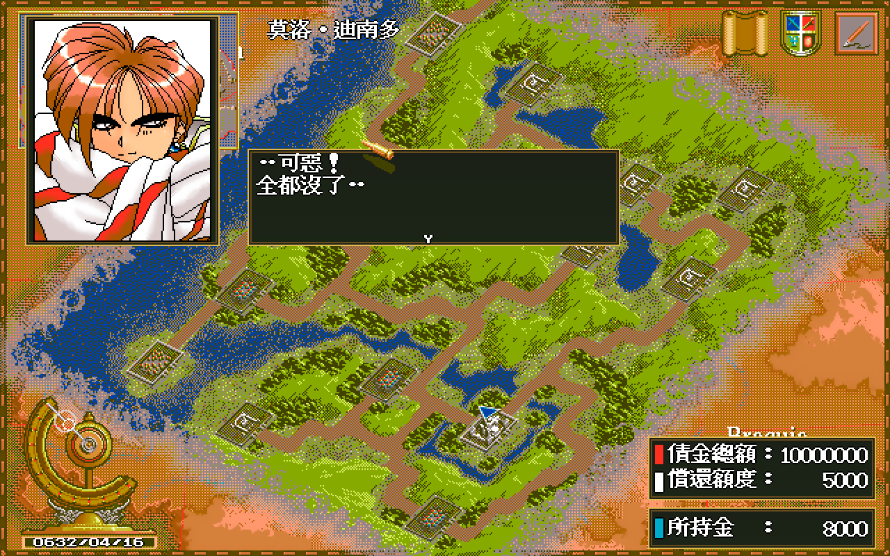
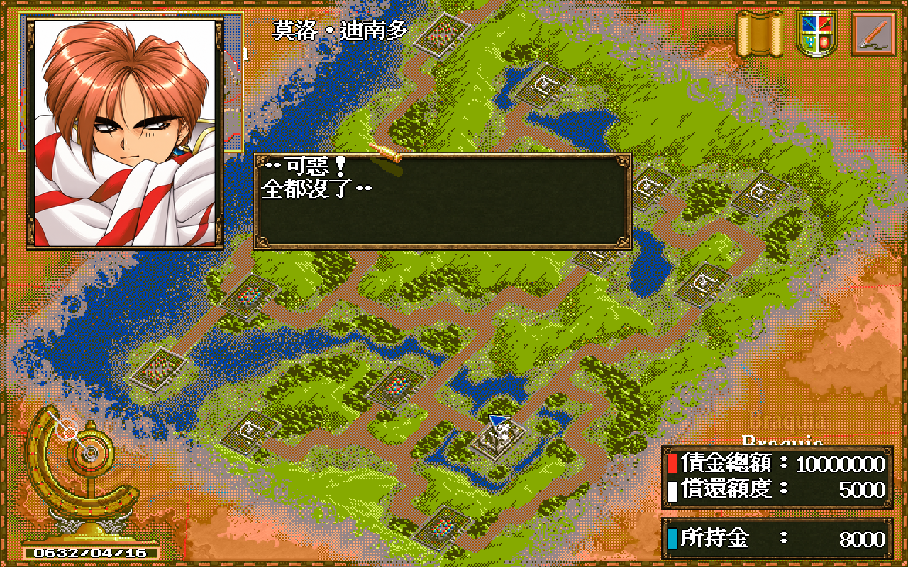
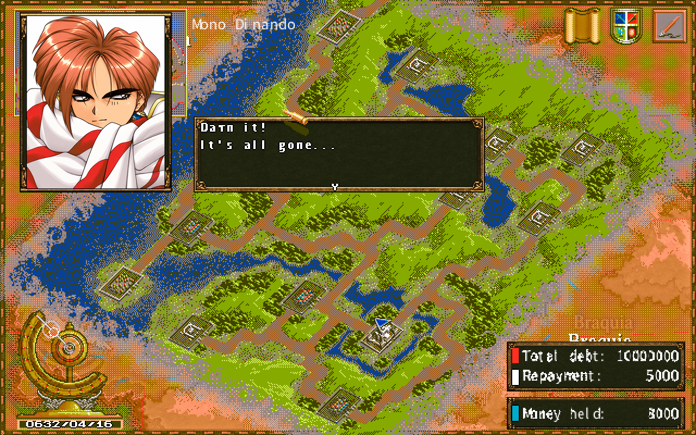
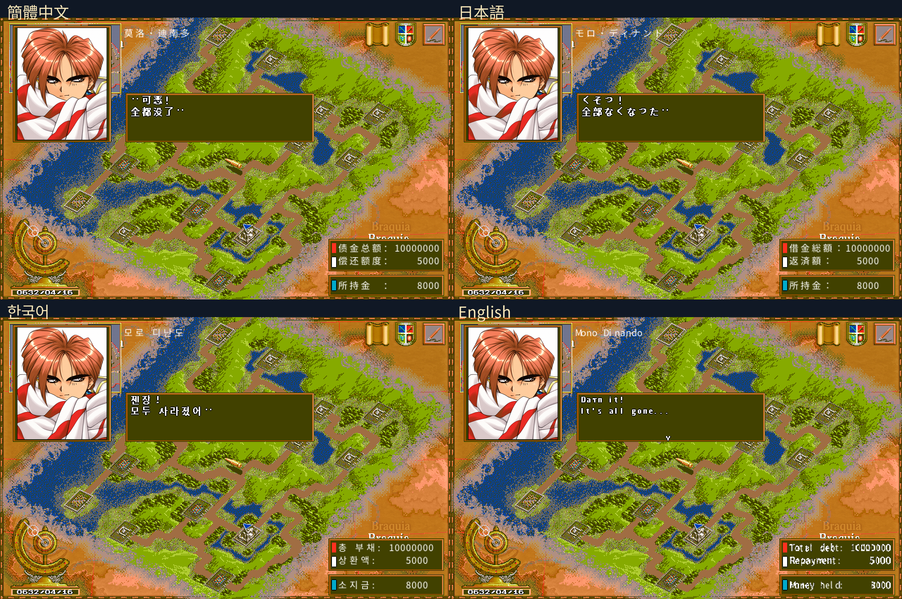
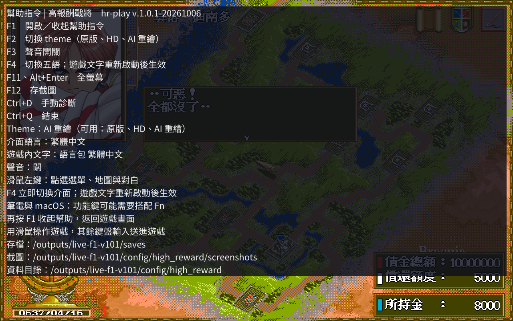

# 高報酬戰將 Remastered

## 故事前言

科學與貿易正在改變這片大陸。舊貴族逐漸失勢，商路糾紛與地方叛亂卻讓傭兵有了生意。父親去世後，莫洛・迪南多接下家族留下的一千萬債務。世界銀行定期上門收款，他只好與夥伴組成傭兵團，接工作、養隊伍，設法還清欠款。背景出自 [PC-98 版遊戲資料](https://refuge.tokyo/pc9801/pc98/01913.html)，DOS 版的債額可見[新遊戲開場畫面](docs/images/l10n-full-zh-TW.png)。

鎮壓叛軍、運送貨物、交易與演出都能帶來收入。每筆報酬還得支付裝備、兵員與還款，這支傭兵團要怎麼經營，由你決定。玩法來源：[PC-98 版資料](https://refuge.tokyo/pc9801/pc98/01913.html)。

[認識開場六位夥伴，查看原版、HD 與 AI 肖像](docs/characters.md)。

## 重製版

用 [dosgolem](https://github.com/wicanr2/dosgolem) 在 Linux、Windows、macOS 執行 DOS 版《高報酬戰將》，加入堆疊溢位修補、HD 與 OpenAI 重繪圖層，以及繁中、簡中、日文、韓文、英文。

**[1.0.2 正式 Release](https://github.com/wicanr2/high_reward_remastered/releases/tag/v.1.0.2-20261008)** 提供 Linux AppImage、Windows ZIP、macOS universal ZIP。GitHub 包含新版素材及譯文，需要自備合法原版；本機完整版另含遊戲。

## 新版 AI 手繪風格

完整 AI 主題有 595 項圖像：594 項由 OpenAI 重繪或與原有 HD 幾何合成，1 項沿用 HD。原版、HD、AI 三種圖層可用 F2 切換，遊戲邏輯與座標保持原樣。

## 介面板面

HD 與 AI 主題也替換已支援的選單、對話框、肖像邊框與資訊面板。文字與操作座標保持原樣，未知原語保留原版。1.0.2 已加入游標呈現修正與五尺寸板面主題。接線與已驗範圍見[介面契約](docs/spec/011-procedural-ui-themes.md)。

| HD | AI 手繪 |
|---|---|
|  |  |

## 五語遊戲文字

原尺寸畫面：[繁中](docs/images/l10n-full-zh-TW.png)、[簡中](docs/images/l10n-full-zh-CN.png)、[日文](docs/images/l10n-full-ja.png)、[韓文](docs/images/l10n-full-ko.png)、[英文](docs/images/l10n-full-en.png)。

簡中、日文、韓文、英文各接入七檔 2,559 項接受譯文，共 10,236 項。繁中沿用原版及已接受的 17 項校訂。硬編碼文字與商店名稱由顯示層補充翻譯，未知項保持原文；不改原版檔案、遊戲識別值或存檔。英文採雙字共格，韓文詞間空白前進 8 像素。

F4 切換介面語言並儲存偏好，**遊戲內文字在下次啟動生效**。上圖依序按 F4、重新啟動，再正常點選新遊戲擷取。這是接線及切換展示，不是全遊戲版面驗收；譯文未經母語者審閱。

## 遊戲介紹

### 版本與發行

| 項目 | 內容 | 來源 |
|---|---|---|
| PC-98 版 | 1994 年 9 月。廠商多列為 Imagineer（イマジニア），有兩份資料並列 ENIX。定價 9,800 日圓，2HD 磁片 4 枚 | [retroblues 的 Imagineer 作品表](http://retroblues.sakura.ne.jp/regeokiba/imagineer/imagineer.htm)、[PC98 資料頁](https://refuge.tokyo/pc9801/pc98/01913.html)、[巴哈姆特〈[骨灰遊戲]PC98_戰略RPG_高報酬戰將ハイリワード〉](https://home.gamer.com.tw/artwork.php?sn=805367) |
| 發售日 | retroblues 記 9 月 22 日，[1994 年 PC 遊戲年表](https://golden-decade.net/2020/10/02/pcgame1994/)記 9 月 1 日，兩者不一致，本專案未能查到原始發售公告 | 上列來源 |
| DOS 中文版 | 彩虹代理，1996 年 2 月 10 日。台灣由彩虹高科技代理 | [巴哈姆特〈老Ｇａｍｅ：中文遊戲列表 v3.04〉](https://home.gamer.com.tw/artwork.php?sn=5627530)、[骨灰遊戲站列表](https://boneash.oldgame.tw/Pc/pcgame-wg.html)（記 1996）、前述巴哈姆特文章 |

本專案取得的版本是否就是彩虹 1996 年版，沒有查證。`MAIN.EXE` 內的 `Borland C++ - Copyright 1993` 是編譯器的版權年份，不是遊戲的發行年份。

### 玩法

PC-98 資料頁把它歸為即時模擬遊戲，世界觀是槍械與火砲（[PC98 資料頁](https://refuge.tokyo/pc9801/pc98/01913.html)）。1998 年的一篇日文評論也指出，還債是主要目標，事件沒有固定的單一路線（[ぼやき部屋，1998-09-30](http://kareha-azuretune.blogspot.com/1998/09/blog-post_30.html)）。

本專案取得的 DOS 版，開場畫面顯示債金總額 10,000,000，所持金 8,000（見下方截圖）。已知的玩法元素：

- 六支小隊的招募與薪資管理（[巴哈姆特，2009-12-08](https://home.gamer.com.tw/artwork.php?sn=805367)）。
- 陣型影響士兵火力與防線（同上；[GameTime 攻略，2020-01-11](https://palygametime.pixnet.net/blog/post/2137558-%E3%80%90dos%E3%80%91%E9%AB%98%E5%A0%B1%E9%85%AC%E6%88%B0%E5%B0%87%E6%94%BB%E7%95%A5)有練級用的陣型建議）。
- 收入來源有民事任務（GameTime 攻略記每趟一至九萬）、軍事任務（十幾萬以上）與舞蹈團演出，攻略另有貿易路線的建議。巴哈姆特文章還提到做打手、經營商隊與做快遞。
- 巴哈姆特文章作者評為自由度高，但最後的目標就是賺錢，沒有像《文明帝國》那樣的多重破關條件。

### 玩家的當機回報

PTT Old-Games 版 2015 年 9 至 10 月的一串推文裡，有一則寫「當機是中文dos版才有當機bug pc98不會當機」（[PTT Old-Games](https://www.ptt.cc/bbs/Old-Games/M.1442537912.A.280.html)）。這是網友留言，沒有重現步驟，也沒有對照原版的證據。本專案的當機調查見下文。

## 現況

| 功能 | 內容 |
|---|---|
| 主程式 | dosgolem 執行 `MAIN.EXE`，已有標題、新遊戲、讀存檔、系統選單與戰鬥佈陣；不播片頭片尾 |
| 修補與診斷 | 載入時在記憶體內增加堆疊；Ctrl+D 可保存停機診斷。是否涵蓋所有長時間當機仍未知 |
| 畫面 | 原版、595 項 HD、595 項 AI 三種圖層 |
| 語言 | 五語介面與遊戲文字，譯文及純 Noto 字模隨發行包提供 |
| 聲音 | 原版 MIDI 的 FM 近似播放與 PCM 音效；沒有音訊裝置時靜音 |
| 發行 | `v.1.0.2-20261008` 三平台正式 Release；本機完整版與推廣影片集中於 `dist-all/` |

使用者已取消追加遊玩與美術抽樣，後續問題請回報 [GitHub Issues](https://github.com/wicanr2/high_reward_remastered/issues)。本版不宣稱完整通關或全遊戲原版 parity。macOS 未簽章，未做 Windows／macOS 實機驗收。唯一現況入口為 [AGENTS.md](AGENTS.md)，歷程見 [WORKLOG.md](WORKLOG.md)。

## 執行

1. 下載 [正式 Release](https://github.com/wicanr2/high_reward_remastered/releases/tag/v.1.0.2-20261008) 對應平台的包。
2. 將合法原版 `MAIN.EXE` 所在資料夾內容放入 `original/`。AppImage 使用同層 `original/`；Windows 使用程式旁的目錄；macOS 使用 `HighReward.app/Contents/Resources/original/`。也可用 `-orig <目錄>` 指定。本機完整版已附原版。
3. 啟動遊戲，用滑鼠操作。macOS 首次開啟可右鍵選「打開」；筆電功能鍵可能需要 Fn。

| 按鍵 | 功能 |
|---|---|
| F1 | 開啟／收起幫助指令 |
| F2 | 切換原版、HD、AI 圖層 |
| F3 | 聲音開關 |
| F4 | 五語選擇，遊戲文字下次啟動生效 |
| F11／Alt+Enter | 全螢幕 |
| F12 | 截圖 |
| Ctrl+Q | 結束 |
| Ctrl+D | 保存診斷 |

存檔、截圖、診斷與語言包位於使用者資料目錄的 `high_reward/`：Linux `~/.config`、Windows `%AppData%`、macOS `~/Library/Application Support`。原版資料夾保持不變。診斷含原版記憶體，請透過私人管道提供給維護者。

## 建置與交付

所有建置、轉檔及遊戲執行都在 Docker。原版位於 `workplace/orig/`，dosgolem 副本位於 `workplace/dosgolem/`；遊戲專屬提交備份在 `engine/patches/`。

| 入口 | 用途 |
|---|---|
| `tools/play.sh build` | 建置 Linux 前端 |
| `tools/rebuild_toolchain.sh` | 重建固定版本的 Linux 建置、測試與錄影工具鏈 |
| `tools/rebuild_appimage_toolchain.sh` | 恢復固定 runtime 的 AppImage 打包工具鏈 |
| `HR_VERSION=<正式版號> tools/package_full_local.sh` | 從乾淨來源重建含遊戲的三平台本機完整版 |
| `HR_VERSION=<正式版號> tools/package_release_patch.sh` | 重建不含原版遊戲檔的三平台 Release 包；已發布包不覆寫 |
| `tools/promo.sh` | 指定本版錄影與 `HR_PROMO_AUDIO_MODE=original-recording`、`HR_PROMO_AUDIO_FILE`、`HR_PROMO_AUDIO_RECEIPT`，製作 60 秒 1080p 原版配樂影片 |
| `tools/capture_original_music.sh <名稱>` | 原版 MAIN 與原廠 Creative 驅動的 DOSBox-X 錄音；資料、驅動及來源收據留本機 |
| `tools/capture_promo.sh <名稱>` | 正常滑鼠與按鍵錄影；`HR_CAPTURE_BUNDLE_DIR` 可指定解出的 AppImage，`HR_CAPTURE_CONTROL_FILE` 可指定控制模板，收據位於 `workplace/out/<名稱>/` |
| [繁中控制模板](tools/promo_control_zh-TW.json)、[英文控制模板](tools/promo_control_en.json) | F2／F1／F4、游標及正常新遊戲錄影輸入，名稱僅供定位 |
| `tools/l10n/capture_full.py` | Docker 內擷取五語新遊戲畫面及 F4 下次啟動切換 |
| `tools/l10n/bakeglyphs.sh` | 從固定 Noto 來源重烘字模補丁 |

目前交付目錄為 `dist-all/v.1.0.2-20261008/`：`full-local/` 是含遊戲的三平台完整版，`patch/` 是 GitHub 發行包，`promo/` 是完成的 60 秒推廣片與檢查，`smoke/` 保存本版畫面與交付紀錄，`SHA256SUMS.json` 保存雜湊。影片配樂取自原版程式與原廠 SB16 驅動的 DOSBox-X 播放錄音。含原版遊戲的完整版與原版配樂影片只留本機。

## 文件與素材

| 位置 | 內容 |
|---|---|
| [AGENTS.md](AGENTS.md) | 現行交付決定、規則與里程碑 |
| [WORKLOG.md](WORKLOG.md) | 工作歷程與勘誤 |
| [登場人物與肖像](docs/characters.md) | 開場六位夥伴介紹，原版、HD 與 AI 肖像對照 |
| [docs/spec/](docs/spec/) | 執行層、圖層、聲音與多語系契約 |
| [游標呈現修正](docs/re/033-cursor-presentation.md) | 修正現況、測試與已驗範圍 |
| [介面主題接線](docs/spec/011-procedural-ui-themes.md) | 程序板面的美術與呈現契約 |
| [docs/re/](docs/re/) | 原版位元組、位址、雜湊與執行證據 |
| [hd/](hd/) | 演算法 HD 素材 |
| [hd-ai/](hd-ai/) | OpenAI 重繪主題及來源清冊 |
| [l10n/](l10n/) | 接受譯文、顯示譯表與 OFL 字模補丁 |
| [docs/images/](docs/images/) | README 的實際執行截圖 |
| [engine/patches/](engine/patches/) | dosgolem 遊戲專屬提交備份 |

## 權利與授權

本儲存庫公開收錄程式、美術衍生圖、譯文表、執行截圖與人物介紹用肖像。原版執行檔、完整資料檔、字庫、音樂與編譯語言包不進 Git 或 GitHub Release。原版及第三方享有權利的部分不由本專案授權，遊玩仍須自備合法原版。

程式與作者創作採 [RRSAL-1.0](LICENSE)，屬 source-available；第三方元件及 Noto 字型依各自授權。本專案與原版權利人沒有隸屬、合作或授權關係。
