# 登場人物與肖像

莫洛・迪南多背著家族的一千萬債務出發，身旁的夥伴也各有打算。有人提醒他面對欠款，有人希望靠生意或演出賺錢，也有人惦記家族復興後的生活。這裡介紹新遊戲開場的六位夥伴。

每組由左至右為原版、HD、AI 重繪。原版肖像維持 128×160 像素；HD 是演算法強化，AI 版由 OpenAI 依原版重繪。遊戲中可按 F2 切換這三種圖層。

## 莫洛・迪南多

家族負債後帶領夥伴重新出發的主角。他領著迪南多第１傭兵團，既想重振家族，也得先處理眼前的欠款。開場雖然沮喪，仍向夥伴求助，決定一起賺錢還債。

| 原版 | HD | AI 重繪 |
|---|---|---|
|  | 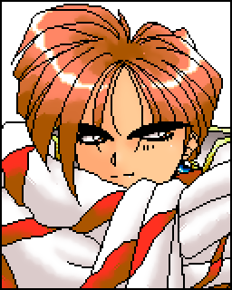 | 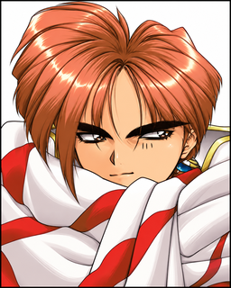 |

## 傑西・亞哲魯

迪南多第２傭兵團的領隊。莫洛感謝他一路相助，他卻直接提醒莫洛：還有債要還，起點比零更低。他也催促大家早點動身，別只顧著討論。

| 原版 | HD | AI 重繪 |
|---|---|---|
| 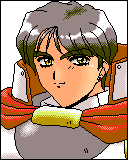 |  | 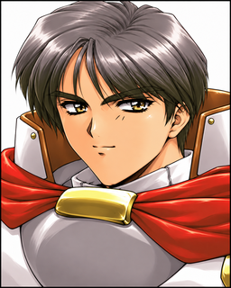 |

## 鐵盧姆・雷姆

雷姆武裝商團的領隊。他勸莫洛別灰心，相信失去的東西還有機會回來。家族復興並不容易，但他願意陪著莫洛一起面對。

| 原版 | HD | AI 重繪 |
|---|---|---|
| 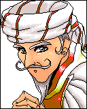 | 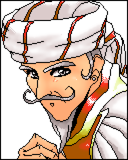 | 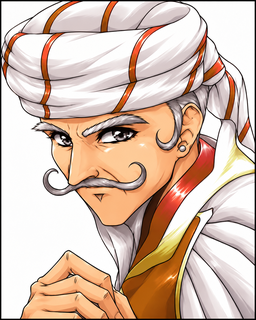 |

## 露・多明妮

「多明妮等一行人」的領隊。她見莫洛陷在煩惱裡，要他先振作，把力氣放在賺錢上。開場對話裡，她給的是最直接的鼓勵。

| 原版 | HD | AI 重繪 |
|---|---|---|
|  | 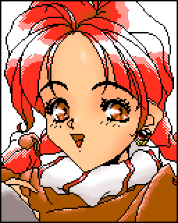 | 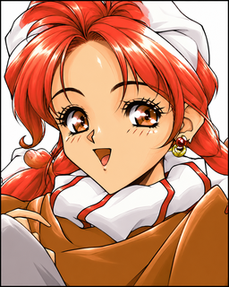 |

## 迪詩蕾德

迪詩蕾德舞踊團的領隊。她對自己的魅力很有信心，認為還債難題能夠解決。她也希望等莫洛重振家族，能受邀參與宮廷聚會。

| 原版 | HD | AI 重繪 |
|---|---|---|
|  | 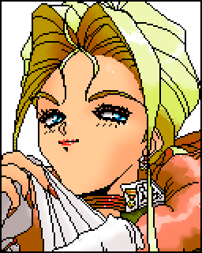 | 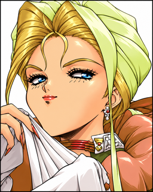 |

## 波魯斯曼

波魯斯曼槍兵團的領隊。他提醒莫洛，局勢再動盪，也要守住自己的原則。在夥伴談論如何還債時，他惦記的還有行事的分寸。

| 原版 | HD | AI 重繪 |
|---|---|---|
| 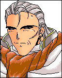 | 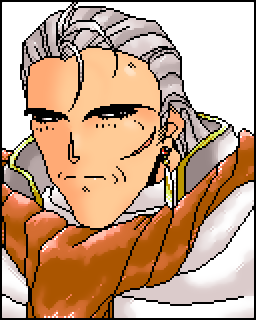 | 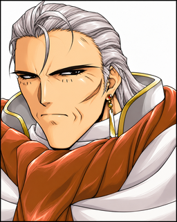 |

## 資料依據

人物簡介整理自[已接受的開場對白](../l10n/zh-TW/ESPMES.MRG.tsv)第 `ESPMES#121.0` 至 `#121.15` 項，以及 [MAIN 文字表](../l10n/zh-CN/MAIN.EXE.tsv)的原文名稱欄。只介紹開場已確認的六位人物，不以其他肖像的外觀猜測姓名或身世。

| 人物 | 肖像識別 | MAIN 名稱位置 |
|---|---|---|
| 莫洛・迪南多 | `FACE.MRG:0` | `MAIN@IDA:4073:2BF4` |
| 傑西・亞哲魯 | `FACE.MRG:1` | `MAIN@IDA:4073:2D72` |
| 鐵盧姆・雷姆 | `FACE.MRG:2` | `MAIN@IDA:4073:2EF0` |
| 露・多明妮 | `FACE.MRG:3` | `MAIN@IDA:4073:306E` |
| 迪詩蕾德 | `FACE.MRG:4` | `MAIN@IDA:4073:31EC` |
| 波魯斯曼 | `FACE.MRG:5` | `MAIN@IDA:4073:336A` |

姓名與肖像配對依據：[原版圖像解碼與主角對照](re/006-image-and-container-formats.md)、[繁中試點與對齊畫面紀錄](re/031-l1-localization-pilot.md)，以及 README 的[夥伴畫面](images/ai-full-companions.png)。HD 與 AI 的來源及方法分別見 [HD 清冊](../hd/catalog.tsv)、[HD 製作方法](re/015-hd-art-method.md)及 [AI 來源清冊](../hd-ai/provenance.tsv)。

原版肖像與重繪所涉及的原版美術權利不由本專案授權，見 [LICENSE 第 2 條 (c)](../LICENSE)。

[返回專案首頁](../README.md)
